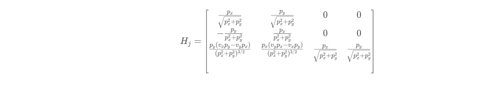

# Extended Kalman Filter

Sensor fusion algorithm using LiDAR and RADAR data to track pedestrian, predicting and updating dynamic state estimation.


This project implements the extended Kalman Filter for tracking a pedestrian, but it could track any traffic participant in the same manner. The intention is to measure the pedestrian’s position and velocity.

Since we are only interested in 2D movement, the state variables are `px`,`py`,`vx`,`vy`. The sensors used for detecting the pedestrian are RADAR and Laser (LIDAR). The advantage of having multiple types of sensors which are fused is obtaining a higher performance. The Laser has a better position accuracy, but the RADAR measures the velocity directly by using the Doppler Effect. The input data for the algorithm is synthetic, meaning that there are not real measurements from real sensors.  
 

This project is implemented in C++ using the Eigen library. The source code is located in `FusionEKF.cpp` and `kalman_filter.cpp` files in the `src` folder above. 

The simulator for this project can be downloaded [here](https://github.com/udacity/self-driving-car-sim/releases)

To run the code, from the terminal use:
1. mkdir build
2. cd build
3. cmake ..
4. make
5. ./ExtendedKF

The starter code for this project is provided by Udacity and can be found [here](https://github.com/udacity/CarND-Extended-Kalman-Filter-Project)
At the same location you can find installation details 


## Prediction

The Kalman Filter works in a sequence of `Prediction` - `Update` cyclically computed. Each time a new measurement is received from one of the sensors, a prediction is computed first. 

The Kalman Filter prediction equations are the following:


where `x` is the current state space, `x'` is the predicted state space and `u` is the control which is zero in this case since we don't control the pedestrian's motion.

`F` is the transition matrix describing the pedestrian's dynamics and `P` is the covariance matrix representing the uncertainty in the state space values, and `Q` is the prediction noise.

Pedestrian's position and velocity prediction is done assuming linear motion with zero acceleration


which written in a matrix form is:


To be able to predict the state estimation, the elapsed time and the transition matrix are needed. The `dt` is simply the time between the previous timestamp and the one carrying the new measurement.

```
// dt - expressed in seconds
  float dt = (measurement_pack.timestamp_ - previous_timestamp_) / 1000000.0;
  previous_timestamp_ = measurement_pack.timestamp_;
```

`F_` is a matrix that, when multiplied with `x`, predicts where the object will be after time `dt`.
Given that our state space `x` is `(px, py, vx, vy)` the `F_` matrix for an object moving with constant velocity is:

```
// the transition matrix F_
  ekf_.F_ = MatrixXd(4, 4);
  ekf_.F_ << 1, 0, dt, 0,
             0, 1, 0, dt,
             0, 0, 1, 0,
             0, 0, 0, 1;
```

There is only one prediction function, regardless if it's calculated for a RADAR or LiDAR measurement. The same equations are used independently from the sensor type. 

```
//state prediction
x_ = F_ * x_;
MatrixXd Ft = F_.transpose();
P_ = F_ * P_ * Ft + Q_;
```

`P_` is the covariance matrix to which the process noise is added. When initialized, the `P_` matrix gets the values set below. 

```
// state covariance matrix P
ekf_.P_ = MatrixXd(4, 4);
ekf_.P_ << 1, 0, 0, 0,
           0, 1, 0, 0,
           0, 0, 1000, 0,
           0, 0, 0, 1000;
```

Things to notice here are that the uncertainty of `px` and `py` is small, only one meter. The velocities `vx` and `vy` have a high, 1000 meters per second, uncertainty. These values get lower every cycle a measurement update is performed.

The `Q_` process noise takes into account that the prediction is known not to be accurate and it’s meant to increase the uncertainty after each prediction. 

Since the acceleration is unknown we can add it to the noise component. So, we have a
random acceleration vector `ν` in this form:


The acceleration is a random `[ax, ay]` vector with zero mean and standard deviation `σax` and `σay`.

`ax` and `ay` are assumed uncorrelated noise processes, so after combining everything in one matrix we obtain our 4 by 4 `Q_` matrix:


The `σax` and `σay` implemented as `noise_ax` and `noise_ay` are given for the project to be `9.0` meters per second squared.

```
// the process noise covariance matrix Q_
  float noise_ax = 9.0f;
  float noise_ay = 9.0f;
  float dt4 = (dt*dt*dt*dt)/4;
  float dt3 = (dt*dt*dt)/2;
  float dt2 = (dt*dt);
  
  ekf_.Q_ = MatrixXd(4, 4);
  ekf_.Q_ << dt4*noise_ax, 0, dt3*noise_ax, 0,
             0, dt4*noise_ay, 0, dt3*noise_ay,
             dt3*noise_ax, 0, dt2*noise_ax, 0,
             0, dt3*noise_ay, 0, dt2*noise_ay;
```


## Measurement Update - LiDAR

For the *Update* step, we need to know which sensor is sending the data. This information is relevant to determine the measurement update equiations.

The Kalman Filter measurement update equations are the following:


where `z` is the measurement vector and `x'` is the predicted state space. `K` is the Kalman gain just used for calculation purposes and `R` is the measurement noise.

For a lidar sensor, the `z` vector contains the `[px,py]` measurements. `H` is the matrix that projects your belief about the object's current state into the measurement space of the sensor. For lidar, this is a fancy way of saying that we discard velocity information from the state variable since the lidar sensor only measures position: 
The state vector `x` contains information about [p_x, p_y, v_x, v_y] whereas the `z` vector will only contain [px, py]. Multiplying `H` allows us to compare `x'`, the predicted state, with `z`, the sensor measurement.

```
 // measurement matrix - laser
H_laser_ << 1, 0, 0, 0,
            0, 1, 0, 0;
```

The implementation fo the measurement update is given below. `x_` is the predicted state and `z_pred` is `x_` in the form of the measurement vector. Substracting the two gives us the error `y`.

```
VectorXd z_pred = H_ * x_;
VectorXd y = z - z_pred;
MatrixXd Ht = H_.transpose();
MatrixXd S = H_ * P_ * Ht + R_;
MatrixXd Si = S.inverse();
MatrixXd PHt = P_ * Ht;
MatrixXd K = PHt * Si;
//new estimate
x_ = x_ + (K * y);
long x_size = x_.size();
MatrixXd I = MatrixXd::Identity(x_size, x_size);
P_ = (I - K * H_) * P_;
```
 
`R_` is the measurement noise that is taken into account knowing the precision of each sensor. For laser `R_` is:

```
//measurement covariance matrix - laser
  R_laser_ << 0.0225, 0,
              0, 0.0225;
```

This is LiDAR's best feature, being able to detect onjects with a precision of about 2 centimeters.


## Measurement Update - RADAR

RADAR measures the environment around making use of the polar coordinates. A RADAR measurement implies the range (object's distance from the sensor), the bearing (object's angle in sensor's coordinates) and the range rate (object's velocity in the range direction).


The measurement function is defined to shape the predicted state estimation into the sensor measurement form.


Given that polar coordinates are transformed into cartesian, the resulting measurement function is below:


This function could be performed on the predicted state estimation but the problem is it's non linearity.
Non linear functions applied to Gaussian distribution lead to non Gaussian resulting distributions. To linearize, the first derivative of the `h` function is calculated with respect of each variable of the state estimation vector. This is called the Jacobian `Hj`.




The Jacobian matrix needs to be calculated at each cycle because the state estimation vector changes and the derivatives need to be calculated in different points. 

```
MatrixXd Hj(3,4);
// recover state parameters
float px = x_state(0);
float py = x_state(1);
float vx = x_state(2);
float vy = x_state(3);
float pxysqr = powf(px, 2) + powf(py, 2);
float pxysqrrt =  hypotf(px, py);

// check division by zero
if (fabs(pxysqr) < 0.0001) {
  cout << "CalculateJacobian () - Error - Division by Zero" << endl;
  return Hj;
}
// compute the Jacobian matrix  
Hj << px/pxysqrrt, py/pxysqrrt, 0, 0,
      -py/pxysqr, px/pxysqr, 0, 0,
      py*(vx*py-vy*px)/powf(pxysqrrt,3), px*(vy*px-vx*py)/powf(pxysqrrt,3), px/pxysqrrt, py/pxysqrrt;

return Hj; 
```

This is to be used for the Extended aspect of the Kalman Filter which represents the need to linearize non-linear functions by taking the tangent in the respective point so transformation can be applied and the Gaussian covariance is kept. 

Calculate `z_pred` by applying the `h` nonlinear function to the predicted state estimation. Vector `y` is the error between the prediction and the measurement.

```
// transform predicted state from cartesian to polar coordinates
// h fuction is applied since the transformation is non linear
float zp1 = hypotf(px, py);
float zp2 = atan2(py,px);
if (fabs(zp1) < 0.0001) {
  cout << "UpdateEKF () - Error - Division by Zero" << endl;
  return;
}
float zp3 = (px*vx + py*vy)/zp1;
// assembly predicted z vector in polar coordinates
VectorXd z_pred(3);
z_pred << zp1, zp2, zp3;
VectorXd y = z - z_pred;
```

Use the JAcobian th calculate the KAlman gain and update the state estimation and covariance matrix.

```
// calculate the Extended Kalman Filter matrices using the Jacobian to linearize the measurement function
MatrixXd Hjt = Hj_.transpose();
MatrixXd S = Hj_ * P_ * Hjt + R_;
MatrixXd Si = S.inverse();
MatrixXd PHt = P_ * Ht;
MatrixXd K = PHjt * Si;
//new estimate
x_ = x_ + (K * y);
long x_size = x_.size();
MatrixXd I = MatrixXd::Identity(x_size, x_size);
P_ = (I - K * Hj_) * P_;
```

`R_` for RADAR is 
```
//measurement covariance matrix - radar
R_radar_ << 0.09, 0, 0,
            0, 0.0009, 0,
            0, 0, 0.09;
```

The values are taken from the RADAR sensor specs.


## Calculate RMSE

Root Mean Squared Error is used to evaluate the performance of the algorithm. The pedestrian's estimated position using the Extended Kalman Filter is compared with the ground truth. 


The goal of the project is to get `px` , `py` RMSE below `.11` meters and `vx` , `vy` RMSE below `.52` meters per second.

After checking that the size of the estimations vector is not zero and that the estimations and the ground truth data matches in size, I loop over all estimations and subtract the ground truth values. 

Because I am using VectorXd from Eigen library, vectors can be subtracted directly. 

```
// accumulate squared residuals
  for (int i=0; i < estimations.size(); ++i) {
    // calculate residuals
    r = estimations[i]-ground_truth[i];
    r = r.array()*r.array();
    //cout << r << endl;
    sqr_residuals.push_back(r);
  }  

```

Now that we have the error vector for each cycle we can go ahead and raise to the power of 2. All these squared residuals are kept into: `vector <VectorXd> sqr_residuals; `

```
  // calculate the mean
  for (int i=0; i < sqr_residuals.size(); ++i) {
    rmse = rmse + sqr_residuals[i];
  }
  rmse = rmse.array()/sqr_residuals.size();
  // calculate the squared root
  rmse = rmse.array().sqrt();
  // return the result
  return rmse;
```

This is a convenient format because now I can sum them up and divide by the number of cycles to calculate the mean and finally to extract the squared root. This provides a four elements vector that is the result the function returns. 


The Extended Kalman Filter is ran on the simulator and it's tracking values are compared to the ground truth. The results are good, position is tracked within 10 centimeters per direction and velocity within 0.5 meters per second per direction.

The main challenge is that the object is moving on curved trajectories and it's acceleration is non zero.


